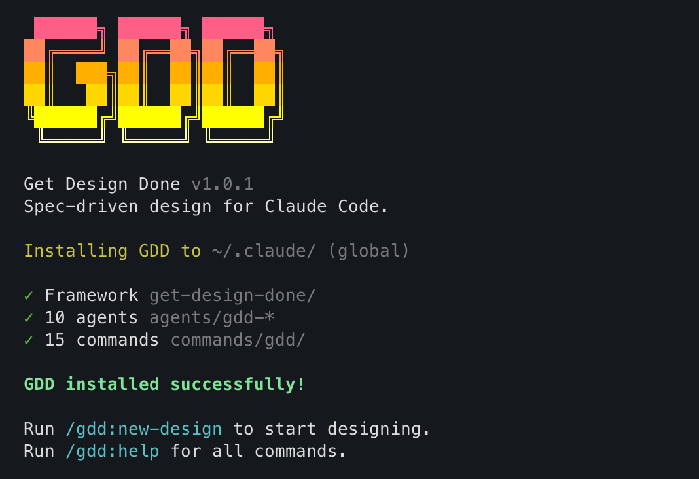

# Get Design Done (GDD)

[](https://www.npmjs.com/package/get-design-done)

Spec-driven design for [Claude Code](https://claude.ai/claude-code).

A system of design-expert agents that lets software engineers produce complex, production-quality designs — from design systems to full screens — without needing design expertise themselves.

<!-- TODO: Add demo GIF here -->

## The Problem

You're a software engineer. You can build anything, but designing it well is a different skill. You know enough to have taste, but not enough to execute confidently — and design tools assume you already have the expertise.

## The Approach

GDD gives you a team of specialized agents that carry the design knowledge you don't have. They ask the right questions using visual comparisons you can answer, then turn your decisions into executable specs that render real designs.

```
Brief -> Tokens -> Spec -> Render -> Critique
```

Phase 1 builds your design system. Every phase after that produces screens, components, and layouts — all grounded in that system, all spec-driven, all reviewed.

## Install

```bash
npx get-design-done
```



This walks you through choosing global (`~/.claude/`, all projects) or local (`./.claude/`, this project only).

For CI or non-interactive use, pass flags directly:

```bash
npx get-design-done --global   # all projects
npx get-design-done --local    # this project only
```

## Quick Start

```
/gdd:new-design              # Answer questions, get brief + tokens + roadmap
/gdd:spec-phase 1            # Generate the design system spec
/gdd:render-phase 1          # Render it in your design tool
/gdd:critique-phase 1        # Structured review with fixes
```

Then repeat `explore -> spec -> render -> critique` for each phase.

## Key Concepts

### Design-expert agents, not templates

GDD isn't a component library or a starter kit. It's a system of agents that carry deep design knowledge — color theory, typography, spacing, layout, accessibility. They know how to frame questions so engineers can make good decisions without needing the vocabulary.

### Specs drive everything

Every design — whether a token system, a dashboard, or a landing page — starts as a spec. Specs contain token resolutions, layout instructions, and render commands. Not mood boards. Not descriptions. Executable blueprints that a render agent follows step by step.

### Tokens as source of truth

`TOKENS.md` holds every design decision — colors, typography, spacing, shadows, radii. Every render resolves tokens to literal values. Every critique checks compliance. Change a token, re-render, and the system updates.

### No design jargon

Questions use visual comparisons — "More like Notion or Linear?" — not terminology. You make the decisions; the agents handle the craft.

### Structured critique

8-dimension review (hierarchy, consistency, contrast, typography, spacing, alignment, accessibility, production readiness) with severity ratings and fix types (token-fix, render-fix, spec-fix). Not "looks good" — actionable, categorized feedback.

### Tool-agnostic via adapters

Adapters are markdown files mapping abstract operations to MCP tool calls. Currently supports:

- **Paper** — visual rendering on canvas
- **Pencil** — design generation in `.pen` files
- **Generic** — HTML/CSS spec output (no design tool needed)

Adding a tool = writing one markdown file.

## Commands

| Command | Purpose |
|---------|---------|
| `/gdd:new-design` | Initialize project: brief, research, requirements, roadmap |
| `/gdd:explore-phase N` | Discuss vision for a phase |
| `/gdd:spec-phase N` | Create detailed design specification |
| `/gdd:render-phase N` | Execute design in connected tool |
| `/gdd:critique-phase N` | Structured design review |
| `/gdd:edit-tokens` | Modify design system tokens |
| `/gdd:add-component` | Add component pattern to system |
| `/gdd:inspire-phase N` | Research design patterns for a phase |
| `/gdd:audit-consistency` | Token compliance audit |
| `/gdd:audit-accessibility` | WCAG AA accessibility audit |
| `/gdd:export` | Export as CSS, Tailwind, or JSON |
| `/gdd:progress` | Show status, suggest next action |
| `/gdd:resume-work` | Restore context from previous session |
| `/gdd:settings` | Configure preferences |
| `/gdd:help` | Full command reference |

## Workflow

```
Brief -> Explore -> Spec -> Render -> Critique -> (next phase)
```

Phase 1 is always **Design System Foundation** — colors, type, spacing established before any screens. Subsequent phases produce actual designs: dashboards, landing pages, settings screens, whatever your product needs.

## Project Structure

After running `/gdd:new-design`:

```
.design/
  BRIEF.md              # Product, users, brand, goals
  TOKENS.md             # Design system (single source of truth)
  REQUIREMENTS.md       # Design requirements (DES-01, DES-02...)
  ROADMAP.md            # Phase breakdown with success criteria
  STATE.md              # Session memory
  config.json           # Adapter, preferences
  moodboard/            # Visual references
  research/             # Patterns, competitors, trends
  system/               # Detailed design system docs
  phases/
    01-design-system/
      CONTEXT.md        # Exploration notes
      SPEC.md           # Render-ready specification
      RENDERED.md       # Render log
      CRITIQUE.md       # Design review
```

## Requirements

- [Claude Code](https://claude.ai/claude-code) CLI
- For visual rendering: a design tool with MCP support (e.g., [Paper](https://paper.design))
- Without a design tool: GDD outputs HTML/CSS specs via the generic adapter

## License

MIT
